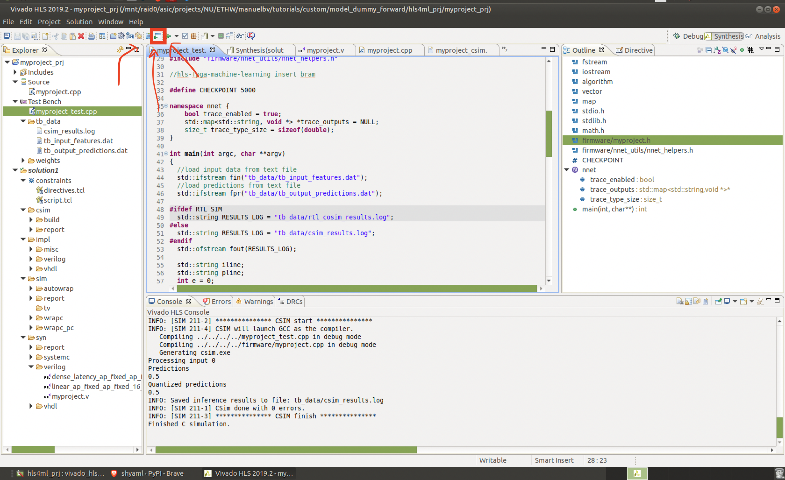

# Edge Trainable Hardware (ETHW)
Author: Manuel Blanco Valentin (manuelvalentin2028@u.northwestern.edu)
Supervisor: Seda Memik (seda@northwestern.edu)

## Structure of this repo

* [README.md](README.md): This file. Contains information regarding this repo, the research and the files found in this directory.
* **datasets**: Folder containing dummy datasets created just to 
* **docs**: Folder containing documentation and literature regarding the research. 
* **tutorials**: Folder containing tutorials and external repos regarding hls4ml, ML, conversion of models, etc.
    * hls4ml-tutorial: Cloned from the [hls4ml-tutorial repo](https://github.com/fastmachinelearning/hls4ml-tutorial). Contains some tutorials on how to use hls4ml to create and convert a ml model into synthesizable code.
    * custom: These are custom tutorials created in the process and research of turning hls4ml models into fully on-edge trainable models.
## 1. Tutorials 

Before diving into the creation of an ML model for an actual application, let's start with the tutorials. 

## 1. Getting used to hls4ml 

### 1.1. hls4ml-tutorial
For this, the first thing to do is to create a conda environment just for hls4ml. Make sure you have conda with python3 installed and create a new environment using the *environment.yml* file in *tutorials/hls4ml-tutorial/environment.yml*. 

```shell
conda env create -f environment.yml
conda activate hls4ml-tutorial
```

### 1.2. Compile the neural network using hls4ml and qkeras
Follow tutorials/custom/part1_custom_dummy_forward_network.ipynb

### 1.3. Run vivado hls directly from the cpp generated by hls4ml

```bash 
cd /home/manuelbv/ETHW/tutorials/custom/model_dummy_forward/hls4ml_prj
vivado_hls build_prj.tcl
```

This should generate a folder named "myproject_prj"

```bash
vivado_hls -p "myproject_prj"
```

GIUSEPPE'S COMMENT:
> We might want to start using floating point instead of fixed or fixed with a lot of bits <128,64>, to make sure that we actually "force" the RTL synthesis to generate MACs, cause for very simple models with very simple arithmetic it might happen that vivado just creates other logic instead of MACs.
Take a look at the documentation/paper of QKeras to see how they implemented backprop in there. Did they use floating point for backprop or fixed point?

Okay, so let's implement giuseppe's suggestion for now. Let's open `myproject.cpp` and let's go to the declaration of `myproject.h` and inside to the declaration of `defines.h`. Then let's change the typedef of all variables to something ridiculous like `<128,64>`, like so:

```cpp
// [@manuelbv]: Changed this to a very large precision for the manual testing/computation of loss
typedef ap_fixed<128,64> model_default_t;
typedef ap_fixed<128,64> input_t;
typedef ap_fixed<128,64> layer2_t;
typedef ap_fixed<128,64> weight2_t;
typedef ap_uint<1> bias2_t;
typedef ap_fixed<128,64,AP_RND,AP_SAT> result_t;
```

Save the file and now run the simulation. To run the simulation, simply click the button highlighted in the following screenshot. 



The simulation should run, but it should tell you that it wasn't able to find the tb_input_data. That's fine, let's now create two files in 
`/home/manuelbv/ETHW/tutorials/custom/model_dummy_forward/hls4ml_prj/tb_data/`

One will be called `tb_input_features.dat` and will contain simply the number `1.0`:

```text
1.0
```

The second will be called `tb_output_predictions.dat` and will contain simple the number `0.5`:

```text
0.5
```

Now re-run simulation using vivado's gui and a message like the following in the log should appear: 

```text
INFO: [SIM 211-4] CSIM will launch GCC as the compiler.
   Compiling ../../../../myproject_test.cpp in debug mode
   Compiling ../../../../firmware/myproject.cpp in debug mode
   Generating csim.exe
Processing input 0
Predictions
0.5 
Quantized predictions
0.5 
INFO: Saved inference results to file: tb_data/csim_results.log
INFO: [SIM 211-1] CSim done with 0 errors.
INFO: [SIM 211-3] *************** CSIM finish ***************
Finished C simulation.
```

Beautiful, this means our simulation is working and it's taking the predictions, as expected. Let's now move-on and start implementing backprop. 


## 2. Implementing backprop in c++

We are going to modify the c++ scripts generated automatically by hls4ml, so it's a good thing if you get acquainted with whatever hls4ml generates (the translation from qkeras/keras to c++). 

### 2.0. Backprop recap

This section is under construction. I'll add any further info about backpropagation and how it works as I need to implement each step of the process. 

These are the steps I hope to divide this section (and the implementation) into:
* Computation of the loss at the final layer
* Computation of the gradient at the final layer
* Propagation of the gradient for previous layers
* Update of the weights & biases

### 2.1. Computation of losses at the final layer

To see how to integrate these losses to the cpp code go to `2.1.x. Integration`

#### 2.1.1. MSE/MAE

Let's create the cpp code that computes mse and mae computation

```cpp

```


### 2.1.x. Integration 

Let's now integrate the computation of the losses with the cpp code we got from hls4ml

```cpp
void myproject(
    input_t fc1_input[N_INPUT_1_1],
    result_t layer3_out[N_LAYER_2],
    unsigned short &const_size_in_1,
    unsigned short &const_size_out_1
) {
    ...
}
```

